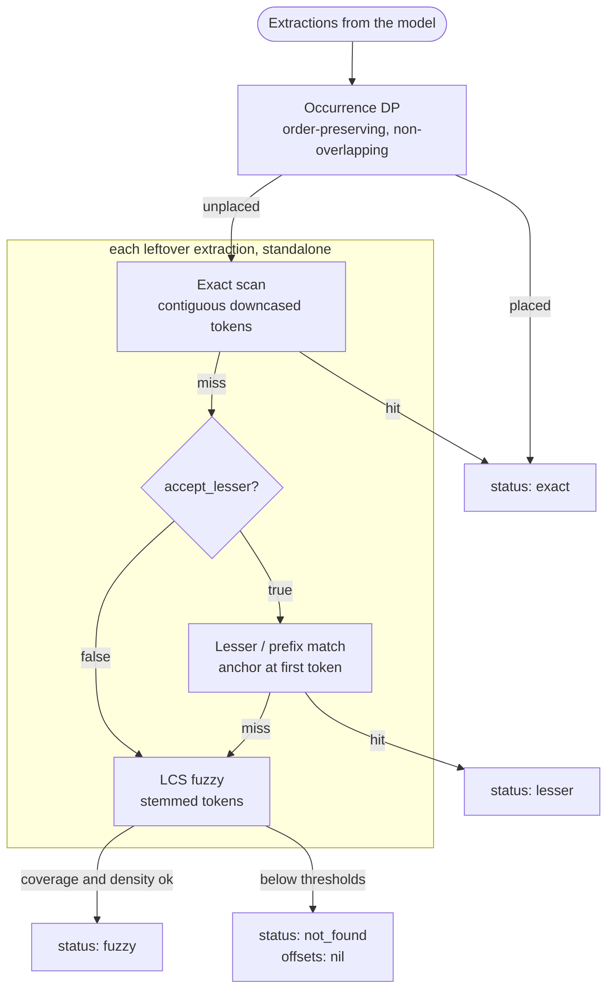

# Alignment and Spans

LangExtract's defining feature is *grounding*: every extraction the LLM
returns is mapped back to the exact place in your source text it came from.
This guide explains how to read the resulting spans, what the alignment
statuses mean, and where the sharp edges are.

## Spans

Every alignment produces a `LangExtract.Span`:

| Field        | Description                                           |
| ------------ | ----------------------------------------------------- |
| `text`       | The extracted text as the LLM returned it             |
| `class`      | Entity class — always set by the pipeline (`nil` for bare `Aligner.align/3` spans) |
| `attributes` | Metadata the LLM attached — not byte-grounded, untrusted |
| `byte_start` | Inclusive byte offset in source (`nil` if not found)  |
| `byte_end`   | Exclusive byte offset in source (`nil` if not found)  |
| `status`     | `:exact`, `:lesser`, `:fuzzy`, or `:not_found`        |

The offsets always refer to the **original document**, even when the source
was chunked — chunk-relative positions are adjusted before spans are
returned.

## Offsets are bytes, not characters

`byte_start`/`byte_end` index into the source *binary*. Recover the grounded
text with `binary_part/3`:

```elixir
binary_part(source, span.byte_start, span.byte_end - span.byte_start)
```

Do **not** use `String.slice/3` with these offsets: it counts graphemes, so
the two disagree as soon as the text contains any multi-byte character —
which real prose does (curly quotes, em dashes, accented names):

```elixir
source = "café au lait"
# A span grounded to "au lait" (as from run/4 or extract/3):
# %Span{text: "au lait", byte_start: 6, byte_end: 13, status: :exact}
# "café " is 5 graphemes but 6 bytes ("é" is 2 bytes).

binary_part(source, 6, 13 - 6)
#=> "au lait"   # correct

String.slice(source, 6, 13 - 6)
#=> "u lait"    # silently wrong — slices by grapheme, not byte
```

Byte offsets are also what makes results stable for storage: they don't
depend on how a consumer counts characters.

## Statuses

- **`:exact`** — the extraction's word tokens were found as a contiguous,
  case-insensitive run in the source. The span covers precisely that run.
- **`:lesser`** — only the extraction's opening fragment exists in the
  source (upstream's `MATCH_LESSER`). The model over-extracted: typically
  it stitched two separated quotes into one extraction, or appended words
  the source doesn't have. The span covers the prefix that *is* there —
  its bytes are verbatim source text, but shorter than the extraction.
- **`:fuzzy`** — the extraction couldn't be matched verbatim, but a
  confident approximate match was found: a window whose tokens differ
  slightly (smart quotes vs ASCII apostrophes, singular vs plural) or that
  interleaves extraction tokens with source-only ones.
- **`:not_found`** — no source region met the acceptance thresholds. The
  offsets are `nil`. Typical cause: the model paraphrased or invented text
  instead of quoting it.

The two inexact statuses fail in different directions, which matters for
anything surfacing spans to a reviewer: a `:lesser` span says "the model's
text says more than the source here," while a `:fuzzy` span says "the
source says roughly this, worded differently." Metrics or highlighting can
use both directly; anything that must be verbatim-faithful should re-check
the span text against the source bytes.

## How alignment works

The aligner mirrors upstream langextract v1.6.0 (+ #485) semantics in four
phases. Occurrence DP runs once over the whole extraction list; leftovers
fall through the remaining phases one extraction at a time:



0. **Occurrence DP** — runs once over the whole extraction list in model
   output order: it selects at most one exact occurrence per extraction,
   keeping selections order-preserving and non-overlapping while maximizing
   total matched tokens. Ties prefer the earliest-ending chain, which is
   what maps repeated mentions to successive occurrences — the second
   "Ahab" extracted from a chunk grounds to the second "Ahab" in the text.
   Status `:exact`. Extractions the DP cannot place fall through, each
   tried standalone by the phases below.
1. **Exact** — linear scan for the extraction's downcased tokens as a
   contiguous run in the source tokens. First occurrence wins.
2. **Lesser (prefix match)** — the longest matching token block anchored at
   the extraction's *first* token. This grounds stitched or truncated
   extractions to their opening fragment. Status `:lesser`.
3. **LCS fuzzy** — a longest-common-subsequence dynamic program over
   normalized tokens (downcased, lightly stemmed). The tightest source
   window is accepted when coverage ≥ `:fuzzy_threshold` and token density
   ≥ `:min_density`. Status `:fuzzy`.

## Tuning

All alignment options are accepted by `LangExtract.run/4` and
`LangExtract.extract/3`, and by the underlying
`LangExtract.Alignment.Aligner` directly:

| Option             | Default | Effect                                                        |
| ------------------ | ------- | ------------------------------------------------------------- |
| `:exact_algorithm` | `:dp`   | `:first_occurrence` disables the occurrence DP (phase 0)      |
| `:fuzzy_threshold` | `0.75`  | Minimum fraction of extraction tokens the LCS match must cover |
| `:min_density`     | `1/3`   | Minimum matched-token density of the accepted source window    |
| `:accept_lesser`   | `true`  | Set `false` to disable prefix matching (phase 2)               |

Raising `:fuzzy_threshold` trades recall for precision: more `:not_found`,
fewer questionable `:fuzzy` spans. Disabling `:accept_lesser` does the same
specifically for `:lesser` spans (stitched-quote fragments).
