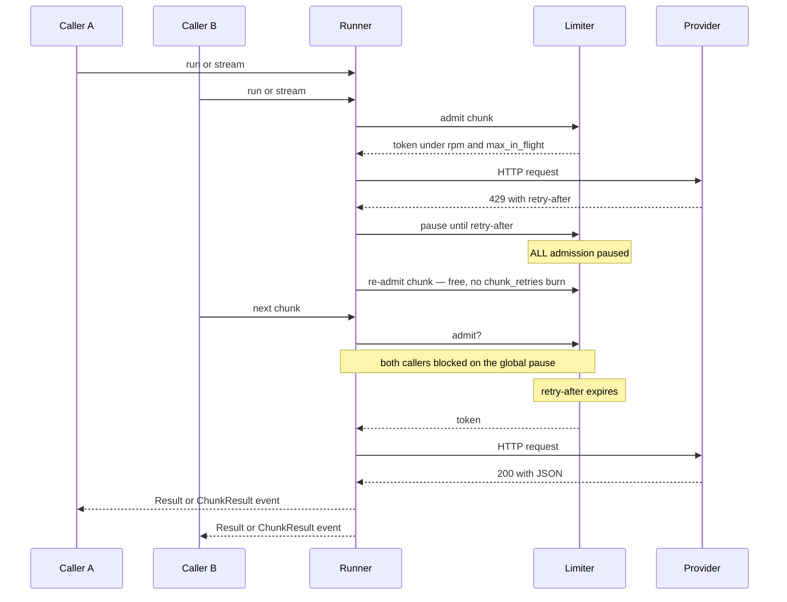
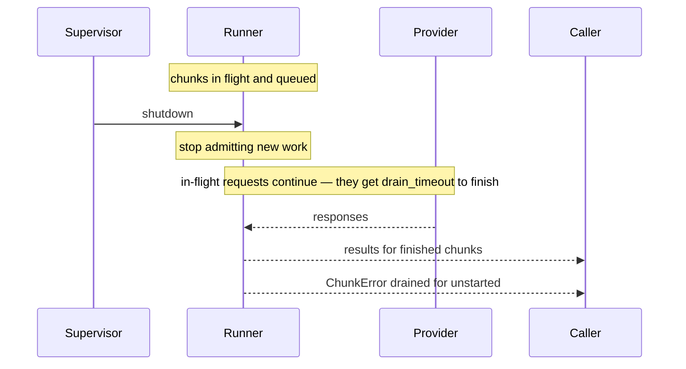
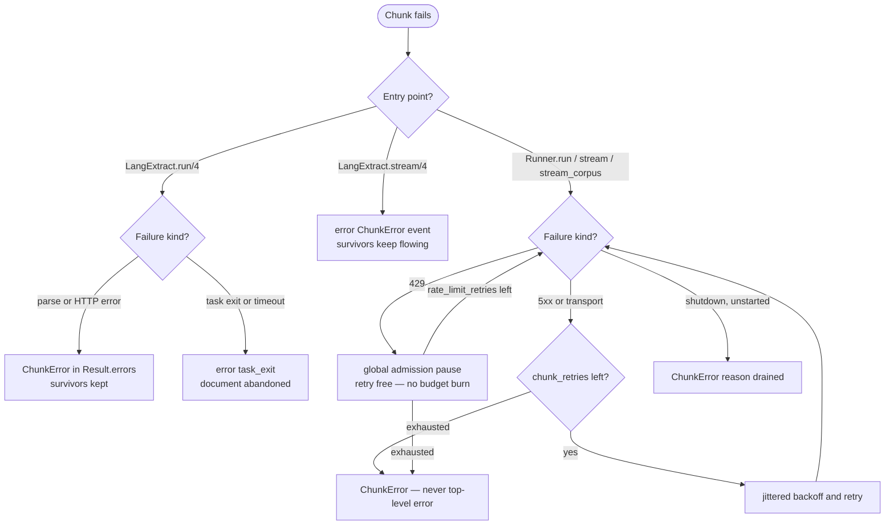

# Running in Production

For scripts and one-off extraction, `LangExtract.run/4` and `stream/4` are
all you need. For an application extracting continuously — multiple
callers, rate limits that matter, deploys that must not lose work — run
extraction through a supervised `LangExtract.Runner`.

## Supervision setup

```elixir
# application.ex
children = [
  {LangExtract.Runner,
   name: MyApp.Extractor,
   client: LangExtract.new(:claude, api_key: System.fetch_env!("ANTHROPIC_API_KEY")),
   max_in_flight: 20,
   rpm: 2_000,
   chunk_retries: 3}
]
```

`MyApp.Extractor` is **not a module you define** — it's just an atom used
as the runner's registered process name, the same idiom as naming a
`Registry` or a Finch pool. Any atom works; module-shaped names are
convention because they can't collide. With the name registered, call the
runner from anywhere in the app:

```elixir
Runner.run(MyApp.Extractor, source, template)
Runner.stream(MyApp.Extractor, source, template)
Runner.stream_corpus(MyApp.Extractor, [{id, source}, ...], template)
```

If you prefer the name to be a real module — for `MyApp.Extractor.run/2`
ergonomics and one place to hold the template — a thin wrapper works:

```elixir
defmodule MyApp.Extractor do
  alias LangExtract.Runner

  def child_spec(_opts) do
    Runner.child_spec(
      name: __MODULE__,
      client: LangExtract.new(:claude, api_key: System.fetch_env!("ANTHROPIC_API_KEY")),
      max_in_flight: 20,
      rpm: 2_000
    )
  end

  def run(source), do: Runner.run(__MODULE__, source, template())
  def stream(source), do: Runner.stream(__MODULE__, source, template())

  defp template do
    LangExtract.template!("Extract ...", examples: [...])
  end
end
```

and `application.ex` shrinks to `children = [MyApp.Extractor]`.

Everything scheduled through one runner shares one budget: two LiveView
processes extracting simultaneously cannot jointly exceed `rpm` or
`max_in_flight`, and a single 429 pauses *all* admission until the
server's `retry-after` deadline — one rejection informs every in-flight
chunk instead of N requests colliding with the same exhausted window.
Run several independent runners for separate budgets (e.g. different
API keys).



On shutdown the runner drains rather than hard-killing work: in-flight
requests finish within `drain_timeout`, and chunks that never started
return as `%ChunkError{reason: :drained}`.



## Sizing the budget

- **`max_in_flight`** — your provider's concurrency comfort zone divided
  by the number of nodes running a runner. This is the wire-level cap;
  the chaos suite verifies it holds regardless of caller count.
- **`rpm`** — your provider tier's requests-per-minute, minus headroom
  for anything else using the key. The bucket allows one full window of
  burst, then refills continuously.
- **`buffer`** — how many undelivered stream results may be outstanding
  (default: `max_in_flight`). A slow consumer halts admission at this
  bound, so memory stays flat no matter how large the document.
- **`chunk_retries`** — retry budget per chunk for 5xx/transport
  failures (default 3). 429 waits never consume it.
- **`drain_timeout`** — grace period for in-flight requests on shutdown
  (default 5s). Size it near your p99 request latency so deploys don't
  kill almost-finished work.

## Failure semantics by mode

`LangExtract.run/4` and `Runner.run/4` look the same at the call site but
are **not** drop-in substitutes — the runner retries failures into
per-chunk errors and never returns `{:error, _}`, while the standalone
function can abandon the whole document on a task exit:



| Event | `run/4` (standalone) | `stream/4` (standalone) | `Runner.*` |
| ----- | -------------------- | ----------------------- | ---------- |
| Parse / HTTP error on a chunk | `ChunkError` in the errors list | `{:error, %ChunkError{}}` event | same, after the runner's retry policy |
| 429 | Req transient retry inside the request | same | global pause until `retry-after`, retried without consuming budget, capped at `rate_limit_retries` |
| 5xx / transport | Req transient retry inside the request | same | jittered backoff, consumes `chunk_retries`; exhaustion → `ChunkError` |
| Chunk task timeout | `{:error, {:task_exit, :timeout}}` — document abandoned | per-chunk `ChunkError`, survivors keep flowing | requests bounded by HTTP timeout; failures stay per-chunk |
| Runner shutdown | n/a | n/a | in-flight finish within `drain_timeout`; unstarted chunks → `ChunkError{reason: :drained}` |

The two retry regimes are deliberate and mutually exclusive: standalone
calls keep Req's transient retry (invisible, per-request); runner calls
disable it and use the runner's policy, because double retry layers
multiply attempts and hide the real failure.

Drain needs no special handling in consumers: a deploy mid-corpus
simply yields more per-chunk errors (`:drained`), and the chunks that
were in flight still deliver their results.

## Observability

The [Telemetry guide](telemetry.md) covers the pipeline events
(document/chunk/request spans with token usage). The runner adds:

| Event | Measurements | Metadata |
| ----- | ------------ | -------- |
| `[:lang_extract, :limiter, :wait]` | `duration` | `reason` (`:rpm` \| `:in_flight` \| `:retry_after`), `limiter` |
| `[:lang_extract, :chunk, :retry]` | `attempt` | `reason` (`:rate_limited` \| `:server_error` \| `:transport_error`), `limiter` |

Limiter waits tell you which budget dimension you're saturating; retry
events with the `limiter` pid attribute retry storms to a specific
runner when several are running.
